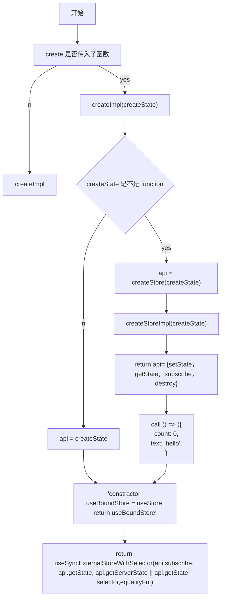

import { PostHeader } from "../components/post-header"

<PostHeader title="zustand 原理介绍" summary="daishi 的 inmutable 的数据流方案" time="2023-03-19" />

 # 好的状态管理库具有的特定

1. 可拓展性
2. 易上手 （概念简单，API 设计简单）
3. 可以自动优化 （比如自动避免 re render, tree shaking 友好）

 # 文档功能简单列举

 ## 基本使用
 > 文档列举出来的功能简单枚举一下

<CH.Code>
```ts main.ts focus=3
import { create } from 'zustand'

const useStore = create((set) => ({
  bears: 0,
  increasePopulation: () => set((state) => ({ bears: state.bears + 1 })),
  removeAllBears: () => set({ bears: 0 }),
}))

function BearCounter() {
  const bears = useStore((state) => state.bears)
  return <h1>{bears} around here...</h1>
}
```
</CH.Code>


<CH.Scrollycoding>
第一段测试
---
```js main.js focus=2
function state(props) {
  const result = []
}
```
---
第二段测试


[222hang](focus://2:2)

```js main.js focus=3
function state(props) {
  const result = []
  return result
}
```
---


[222hang](focus://main1.js#2:2)

```js main1.js focus=3
function state(props) {
  const result = []
  return result
}
```
---

</CH.Scrollycoding>


# Spotlight

This is how to use the `<CH.Spotlight>` component. Lorem ipsum dolor sit amet consectetur adipisicing elit. Quisquam, quia! Quidem, quisquam.

<CH.Spotlight>

```js app.js
function lorem(ipsum, dolor = 1) {
  const sit = ipsum == null && 0;
  dolor = sit - amet(dolor);
  return sit ? consectetur(ipsum) : [];
}
```

---

Change focus

```js app.js focus=2:4

```

---

Or change the code

```js app.js focus=6:10
function lorem(ipsum, dolor = 1) {
  const sit = ipsum == null && 0;
  dolor = sit - amet(dolor);
  return sit ? consectetur(ipsum) : [];
}

function adipiscing(...elit) {
  console.log(elit);
  return elit.map((ipsum) => ipsum.sit);
}
```

---

Or change the file

<CH.Code>

```js app.js focus=1:4
function adipiscing(...elit) {
  console.log(elit);
  return elit.map((ipsum) => ipsum.sit);
}
```

---

```css styles.css
.lorem {
  color: #fff;
  padding: 10px;
  background: #000;
}
```

</CH.Code>

---

### By the way

- you can
- put any
- markdown
- here

👍

```js app.js

```

</CH.Spotlight>